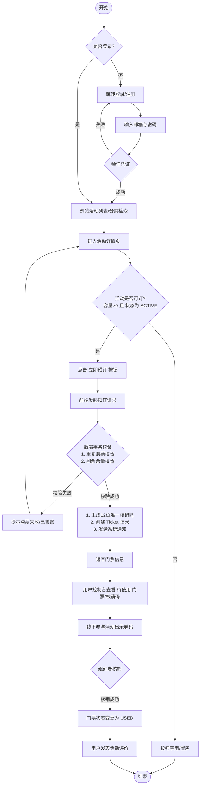
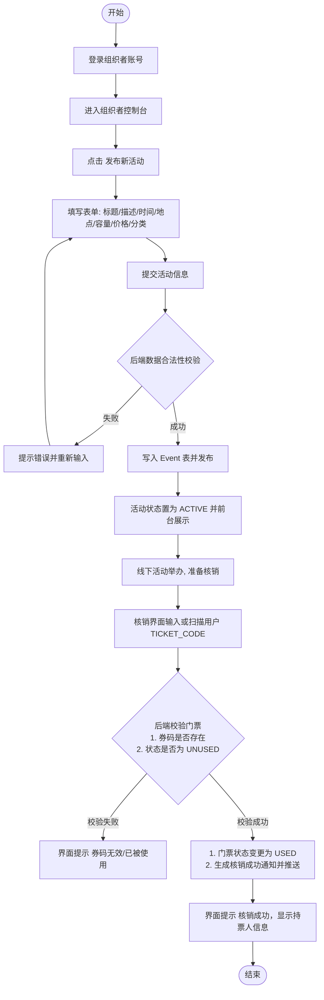
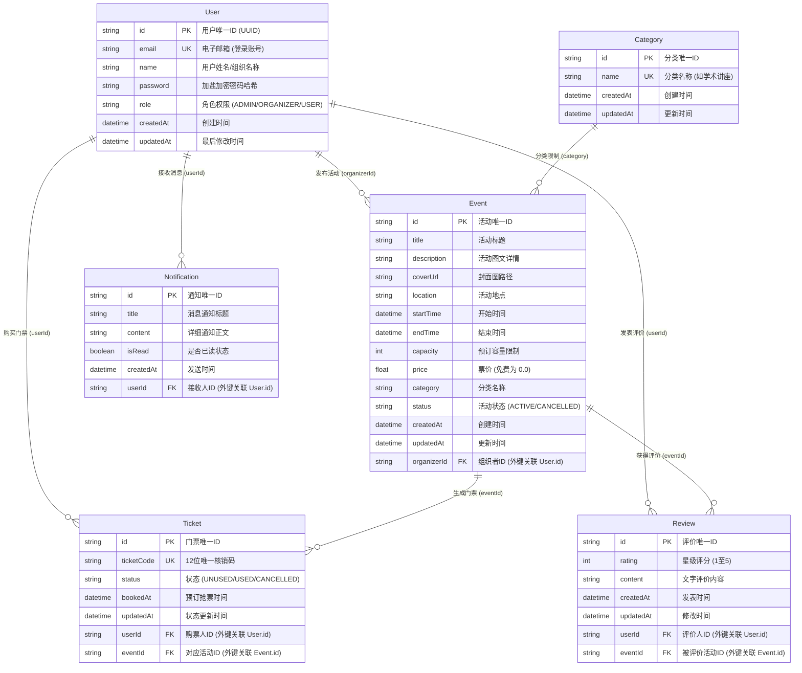
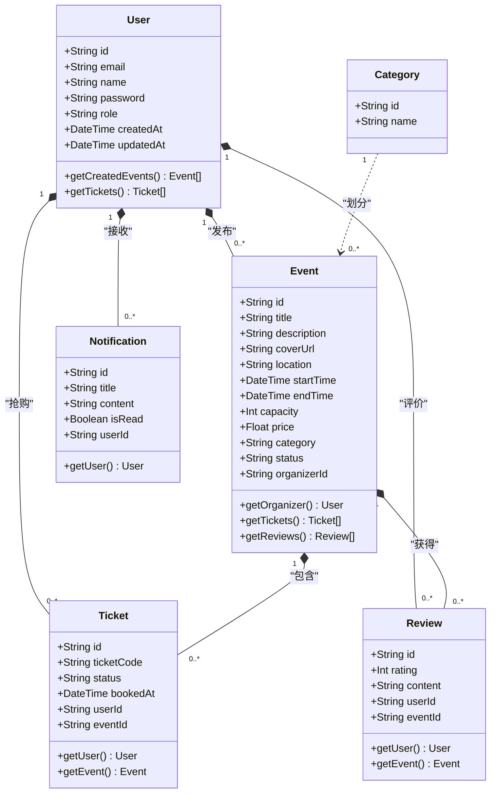
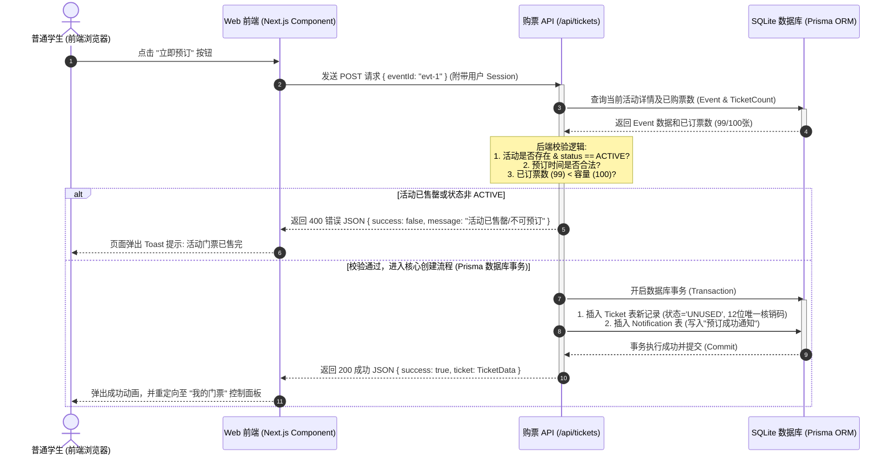
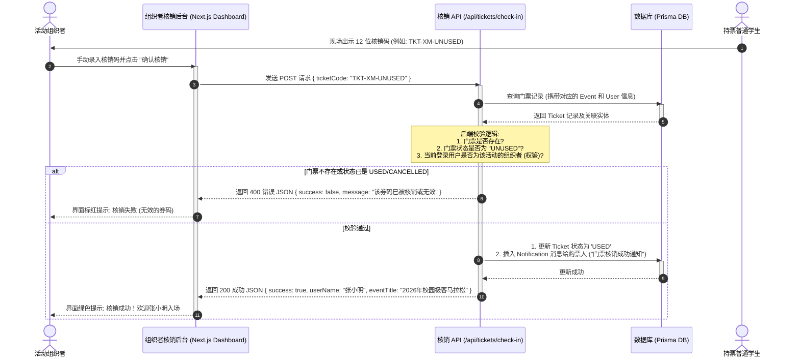

# EventFlow - 系统专业技术文档

本技术文档主要面向系统架构设计评估与论文技术章节撰写，包含了系统的业务流程图、UML类图、UML时序图以及数据库ER图，均采用规范的 **Mermaid** 矢量图语法编写，可直接在支持 Markdown/Mermaid 渲染的阅读器或浏览器中进行查看与编辑。

---

## 一、 系统业务流程图

本节展示了系统核心角色的业务办理流程：包括普通学生的“抢票与核销流程”以及组织者的“活动管理与核销流程”。

### 1. 普通学生购票与核销流程

### 2. 组织者活动发布与核销流程

---

## 二、 数据库 ER 图

本系统采用经典的关系型数据模型，表与表之间建立了严格的外键约束与级联操作。

---

## 三、 UML 类图

展示系统数据模型实体类（通过 Prisma Client 实体生成）以及控制器接口层之间的交互逻辑关系。

---

## 四、 UML 时序图

本节通过时序图展示系统中两个最核心的高并发/状态转换逻辑：**用户在线购票（事务操作）** 以及 **组织者核销门票**。

### 1. 用户在线购票时序图

### 2. 组织者核销门票时序图

